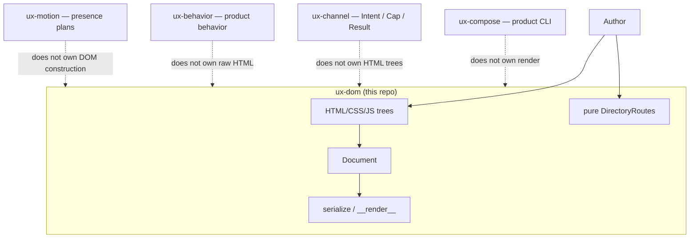
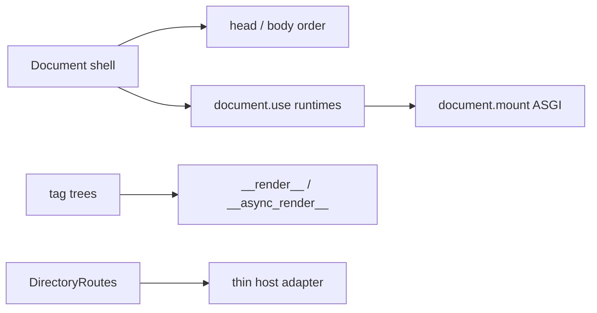

# C4-style overview — ux-dom

> **Diátaxis:** explanation · **Canonical:** `docs/internals/c4.md` · **Layer:** ux-dom
> Map: [../INDEX.md](../INDEX.md).

Grounded in [SYSTEM.md](SYSTEM.md) and [ARCHITECTURE.md](ARCHITECTURE.md).
No new product boxes. This layer **renders**. Product lifecycle is **ux-compose**.

## Context

## Containers (this repo)

See [ARCHITECTURE.md](ARCHITECTURE.md) for the module map. Do not flatten sister layers here.
